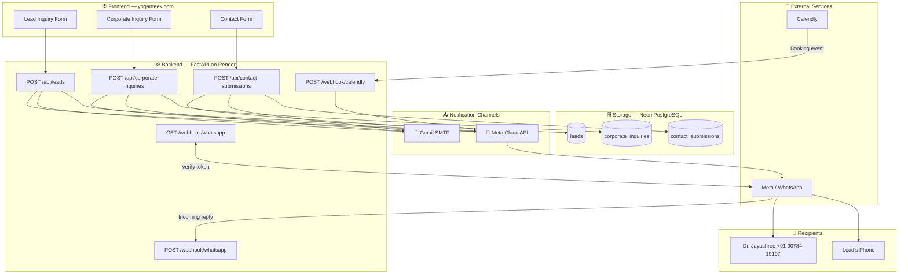
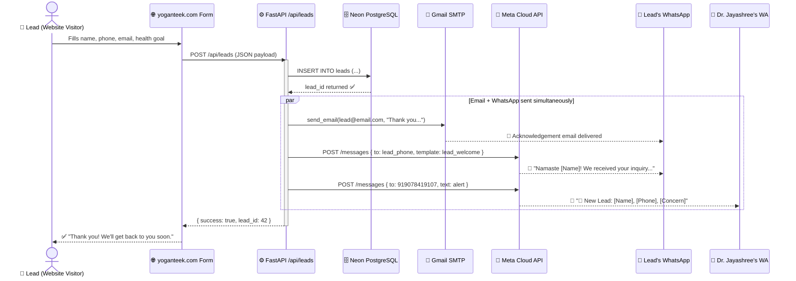
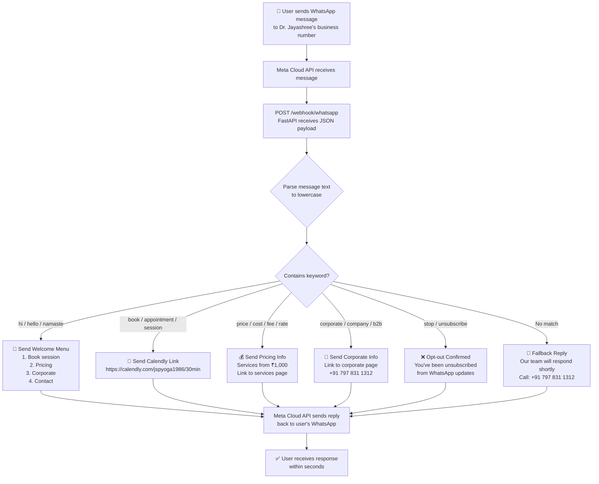
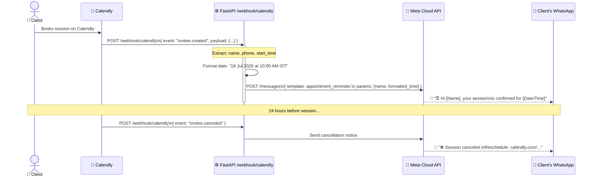
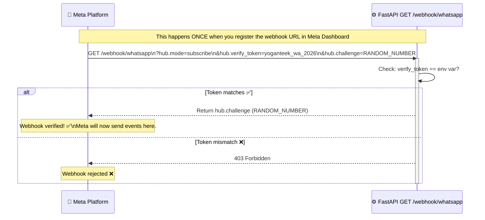
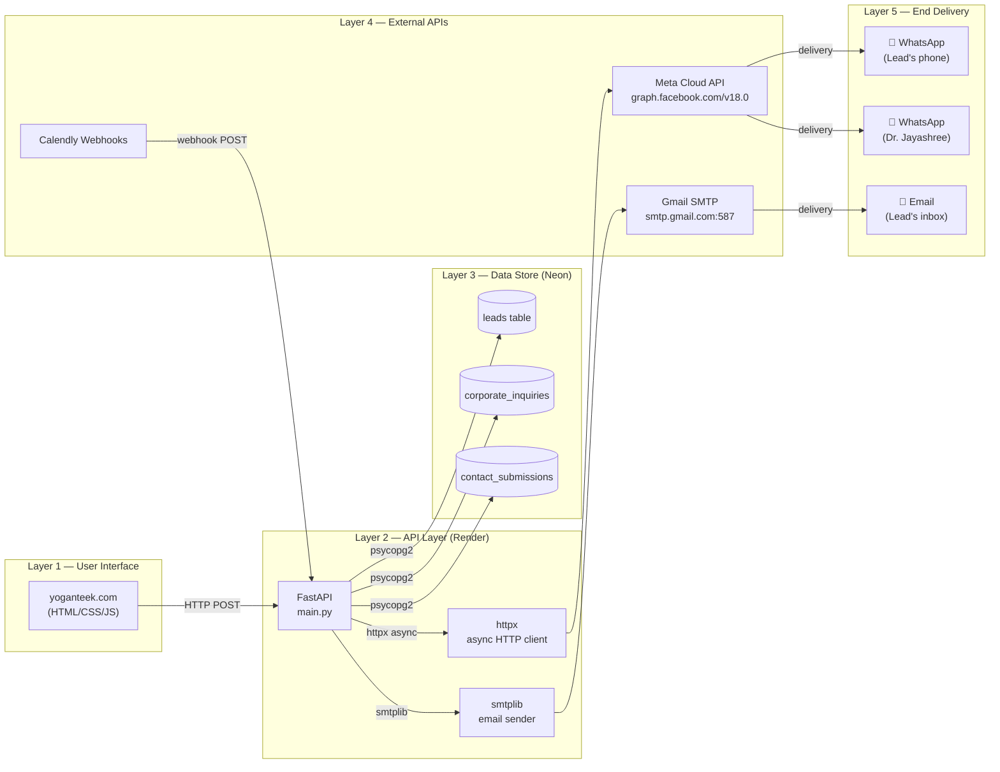

# 🏗️ Yoganteek WhatsApp Automation — Data Flow Architecture

---

## 1. Master System Overview



---

## 2. Lead Form Submission Flow (Most Important)



---

## 3. Incoming Message Auto-Reply Bot Flow



---

## 4. Calendly Booking Reminder Flow



---

## 5. Meta Webhook Verification (One-Time Setup)



---

## 6. Tech Stack Layer Map



---

## 7. Data Payload Map

What data flows at each trigger point:

### 7.1 — Lead Form → Backend
```json
{
  "name": "Ramesh Kumar",
  "email": "ramesh@gmail.com",
  "phone": "9876543210",
  "health_goal": "Stress Relief",
  "concern": "Back Pain",
  "message": "I want to join online classes",
  "calendly_url": null
}
```

### 7.2 — Backend → Meta API (Lead Welcome Template)
```json
{
  "messaging_product": "whatsapp",
  "to": "919876543210",
  "type": "template",
  "template": {
    "name": "lead_welcome",
    "language": { "code": "en" },
    "components": [{
      "type": "body",
      "parameters": [{ "type": "text", "text": "Ramesh Kumar" }]
    }]
  }
}
```

### 7.3 — Meta Webhook → Backend (Incoming Message)
```json
{
  "entry": [{
    "changes": [{
      "value": {
        "messages": [{
          "from": "919876543210",
          "text": { "body": "Hi, I want to book a session" },
          "type": "text"
        }]
      }
    }]
  }]
}
```

### 7.4 — Calendly → Backend (Booking Created)
```json
{
  "event": "invitee.created",
  "payload": {
    "invitee": {
      "name": "Ramesh Kumar",
      "text_reminder_number": "+919876543210"
    },
    "event": {
      "start_time": "2026-07-19T04:30:00Z"
    }
  }
}
```

---

## 8. Summary — What Triggers What

| Trigger | DB Write | Email | WA → Lead | WA → Owner |
|---------|----------|-------|-----------|------------|
| Lead form submitted | ✅ leads | ✅ | ✅ Welcome msg | ✅ Alert |
| Corporate form submitted | ✅ corporate_inquiries | ✅ | ✅ Welcome msg | ✅ Alert |
| Contact form submitted | ✅ contact_submissions | ✅ | ✅ Acknowledgement | ✅ Alert |
| User replies on WA | ❌ | ❌ | ✅ Auto-reply | ❌ |
| Calendly booking | ❌ | ❌ (Calendly does it) | ✅ Confirmation | ❌ |
| Calendly cancellation | ❌ | ❌ | ✅ Cancel notice | ❌ |
